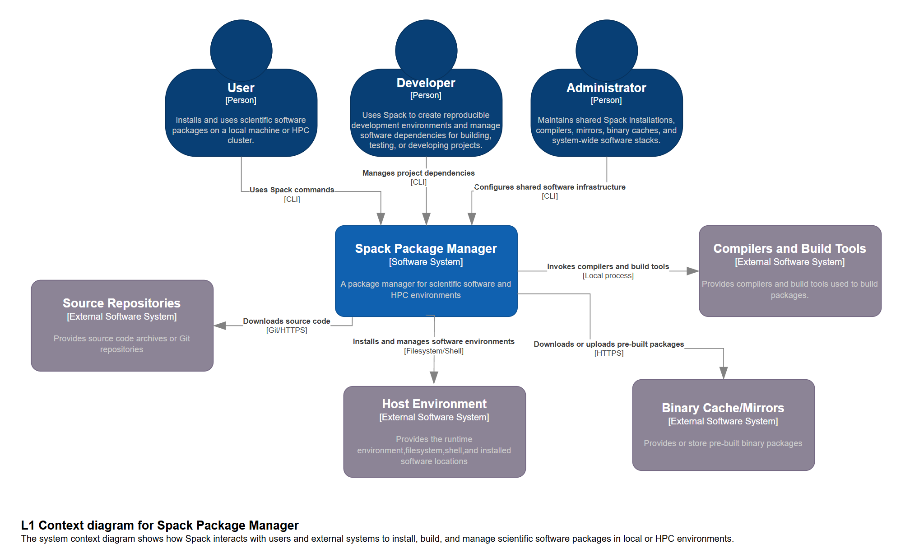
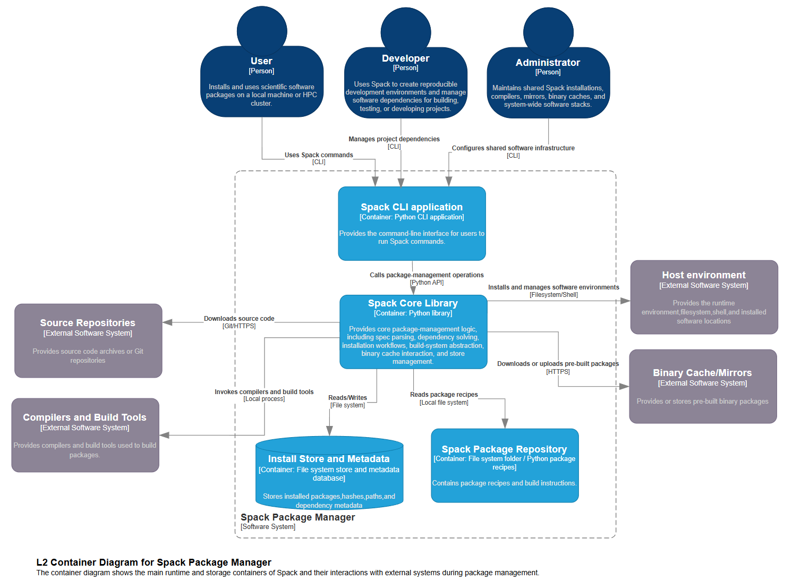
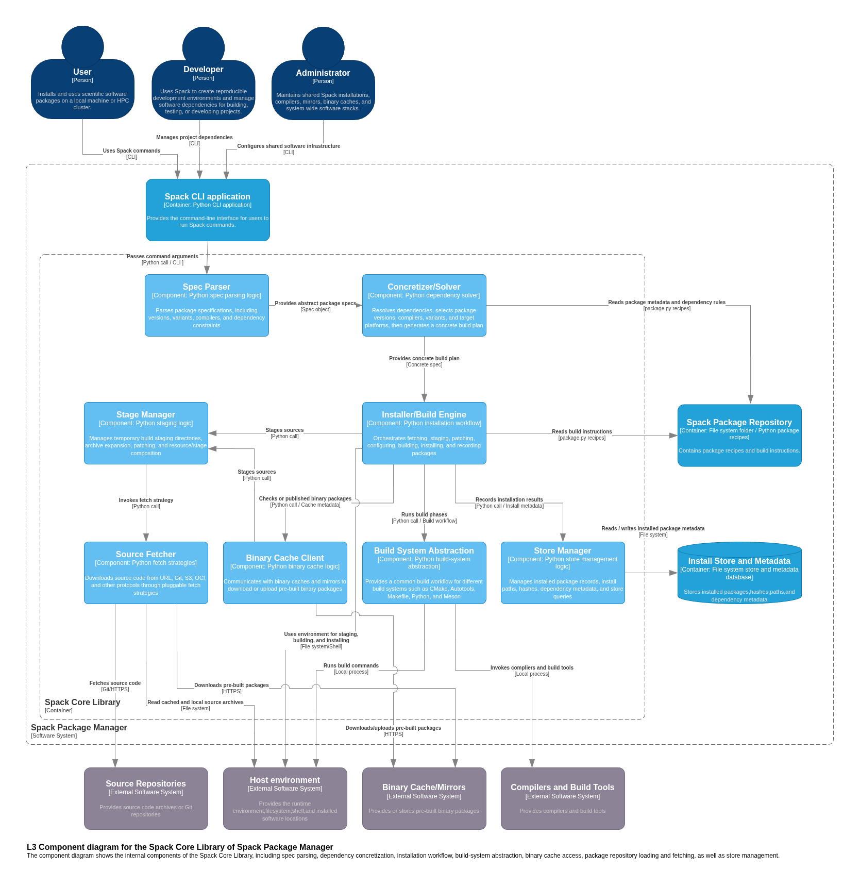

# Software Architecture Analysis

Software architecture report on the `Spack` package management system.

## 1 - C4 Diagrams

We have conducted a review of the source code within `lib/spack/spack` in the spack GitHub repository. The diagrams were created in *draw.io* with the C4 shapes collection.

## 1.2 - Context Level (C4 L1)

At the context level, Spack is represented as a single software system called the Spack Package Manager. This level focuses on the boundary between Spack and its surrounding environment, rather than on Spack’s internal implementation details. The purpose of the context diagram is to show who interacts with Spack and which external systems Spack depends on during package management activities.The main actors are users, developers, and administrators. Users interact with Spack to install, remove, load, and manage scientific software packages. Developers use Spack to define reproducible software environments and manage project dependencies. Administrators, especially in high-performance computing environments, use Spack to maintain shared software stacks, manage compiler configurations, generate modules, and provide packages for multiple users.

The diagram also shows several external systems outside the Spack boundary because they are not implemented or owned by Spack, although Spack depends on them at runtime. Source Repositories provide the actual source code of software packages, such as Git repositories or source archive URLs. Spack does not store all source code internally. Instead, it reads package recipes and fetches the required source code from external repositories when a package needs to be built from source.
Compilers and Build Tools are also modeled as external systems. Spack may detect and use compilers such as GCC, Clang, or Intel compilers, and it may invoke build tools such as CMake, Make, Ninja, Autotools, or Meson. These tools are not part of Spack itself; Spack coordinates their use during the build process.

The Host Environment represents the local machine or HPC cluster on which Spack runs. It provides the filesystem, shell, process execution, environment variables, permissions, and installation locations. Spack relies on this environment to create staging directories, execute build commands, and write installed files. Binary Cache / Mirrors are external storage systems used to store and retrieve pre-built binary packages. If a matching binary package is available, Spack can download and install it instead of building the package from source.

Therefore, the context diagram presents Spack as a coordinator between users, source repositories, build tools, host resources, and binary package storage. This level defines the system boundary and external dependencies, while the internal structure of Spack is described in the lower-level diagrams.
## 1.3 - Container Level (C4 L2)

At the container level, the Spack Package Manager is decomposed into its main runtime and storage containers. In this diagram, a container refers to a major executable unit, library, repository, or persistent storage element inside the software system. The purpose of this level is to explain how Spack is internally organized at a high level.

The first container is the Spack CLI Application. This is the command-line interface used by users, developers, and administrators. Commands such as spack install, spack find, spack spec, spack compiler, and spack mirror enter the system through the CLI. The CLI is responsible for receiving user commands and command-line arguments, but it does not contain all package-management logic by itself. Instead, it delegates the main operations to the Spack Core Library.

The Spack Core Library is the central container of the system. It contains the main package-management logic, including package specification parsing, dependency resolution, concretization, installation workflow coordination, build-system abstraction, binary cache interaction, and store management. For example, when a user requests the installation of a package, the Core Library interprets the requested package specification, resolves dependencies, decides concrete versions and variants, checks whether a suitable binary package is available, coordinates source builds if necessary, and records the installation result.

The Spack Package Repository is modeled as a separate container because it has a different responsibility from the Core Library. It contains package recipes, usually written as package.py files. These recipes describe package versions, dependencies, variants, patches, conflicts, and build instructions. This repository must be distinguished from Source Repositories. The Spack Package Repository stores the instructions that tell Spack how to build a package, while Source Repositories store the actual source code of the software.

The Install Store and Metadata container represents the persistent storage managed by Spack. After a package is installed, Spack stores the installed files, installation paths, hashes, dependency information, and package metadata. This is different from the Spack Package Repository: the package repository describes what can be installed and how it should be built, while the install store and metadata record what has actually been installed and under which configuration.

The container diagram also keeps external systems outside the Spack boundary. Source Repositories, Compilers and Build Tools, Host Environment, and Binary Cache / Mirrors are not part of Spack’s internal implementation, but Spack interacts with them to complete package installation. This separation makes the architecture clearer: Spack internally manages commands, recipes, dependency resolution, installation logic, and metadata, while relying on external systems for source code, compilation, execution environment, and binary package distribution.
## Relationship with the Clean Architecture Blueprint
Spack has some similarities with the Clean Architecture blueprint, but it is not a pure Clean Architecture system. Clean Architecture separates the core logic of a system from external technical details. In Spack, a similar separation can be observed.

The core concepts of Spack are package specifications, packages, dependencies, variants, and concrete specs. These concepts describe what software should be installed, which dependencies are needed, which optional features are selected, and what the final installation plan looks like. They form the central package-management model of Spack.

Around these core concepts, Spack has components that coordinate the main workflows. For example, the concretizer turns an abstract user request into a concrete installation plan. The installer coordinates the process of fetching, building, installing, and recording packages. The concretizer and installer depend on a ring of interface adapters / gateways; the build-system abstraction, binary cache client, store manager, stage manager and source fetcher. These adapaters / gateways translate the workflow's needs into concrete interactions with the outer layer.

The outer layer contains technical details that Spack depends on but does not fully control. These include source repositories, compilers, build tools, binary caches, mirrors, the filesystem, shell commands, the operating system, and HPC module systems. They are necessary for Spack to work, but they are not the core package-management model itself.

Therefore, Spack can be described as having a Clean Architecture-like separation between core concepts, application workflows, and external infrastructure. However, it is not a strict implementation; the installer calls concrete gateways such as the binary cache client directly, and the stage manager inspects concrete fetch strategy types. The separation is present, but not strictly enforced.

## 1.4 - Component Level (C4 L3)


### Components and responsibilties
- **Spec Parser**: Parses CLI-provided package specs into a structured `Spec` object
- **Concretizer / Solver**: Builds a concrete build plan
- **Installer / Build Engine**: Orchestrates the build / install workflow (`installer.py`, `build_environment.py`)
- **Stage Manager**: Manages the build staging area (`stage.py`)
- **Source Fetcher**: Pluggable download strategies (`fetch_strategy.py`)
- **Binary Cache Client**: Pull / push of pre-built packages + indexes
- **Build System Abstraction**: Abstraction layer for build tools (cmake, autotools, make, etc.)
- **Store Manager**: Manages the install store / metadata in the file system and metadata database (**Install Store and Metadata** container)

### SOLID Observations
#### Single Responsibility Principle (SRP)
We observed some violations of SRP, specifically within the Source Fetcher and Stage Manager.
- **Source Fetcher** mixes fetching with terminal progress UI (`FetchProgress`, `_format_speed` and `format_bytes` in `fetch_strategy.py`).
- **Stage Manager** similarly mixes staging with CLI tooling (`interactive_version_filter` and `get_checksums_for_versions` in `stage.py`). These methods bundle checksum/UX concerns into the staging component. 


#### Open-Closed Principle (OCP)
We found a minor OCP weakness in the way `Stage` uses `FetchStrategy`. FetchStrategy itsels follows OCP, but the way `Stage` checks for special cases with isinstance checks on `self.default_fetcher` and `self.fetcher` means that a new strategy might require modifications of other entities. 

#### Liskov Substitution Principle (LSP)
Related to the above minor OCP violation, we find that two derived classes seem to not adhere to their parent classes' interface contracts, thus violating the Liskov Substitution Principle.

`BundleFetchStrategy` (from `fetch_strategy.py`) does not really do any fetching, and just returns `True`, breaking the implied promise of downloading something from a source. The class docstring seems to admit that this is not optimal, but that fixing it requires a refactor: 

```
TODO: Remove this class by refactoring resource handling and the link between composite stages and composite fetch strategies (see #11981)
```

`DevelopStage`'s `fetch()`, `check()` and `expand_archive()` methods also do nothing, as the class handles staging a local dev environment. Both classes are fakes / workarounds for local processes where the full fetching workflow isn't needed. They satisfy the parent class type without satisfying the expected behavior.  

#### Interface Segregation Principle (ISP)
No violations found for this principle

#### Dependency Inversion Principle (DIP)
No violations found for this principle

## 2 - Architectural Characteristics / Qualities

Key characteristics of the Spack system:

### Extensibility
The extensibility of the Spack system is aparent through the use of pluggable fetch strategies, allowing different strategies to be added via a decorator (`fetcher(cls)` in `fetch_strategy.py`). New protocols and build systems can be added as subclasses. With few exceptions, Spack adheres strongly to OCP (see [open closed priciple](#open-closed-principle-ocp)), a principle that promotes extensibility.

### Adaptability
The ease of adapting to changes in environment is crucial for a HPC environment. The architecture reflects this characteristic through host abstraction and layered YAML config files (see `config.py`) which lets the same install run on both a laptop and an HPC cluster.

### Performance
We observe that the performance characteristic has been taken into account in the Spack system architecture. The [C4 component diagram](#14---component-level-c4-l3) shows the **Binary Cache Client**, which allows fetching pre-built binaries instead of building from source. This saves both time and compute. 
Not shown in the component diagram is the local file system cache, defined in `caches.py`, which prevents repeatedly fetching the same files when building a package multiple times or multiple ways. 

### Data Integrity
The system does checksum verification on every fetch (`check()` in `fetch_strategy.py`) and uses cryptographically signed binary packages in **Binary Cache Client**.

### Concurrency
HPC environments can get greater benefit from concurrency than typical personal and enterprise environments. Spack promotes concurrency through parallel build jobs (defaults defined in `config.py`), which also supports the performance characteristic. 

### Abstraction
Abstraction is *the level at which parts of the system are isolated from other parts of the system (both internal and external system interactions)*. Spack abstracts interactions with external systems well, with dedicated gateway components (**Source Fetcher**, **Binary Cache Client**, **Build System Abstraction**, **Store Manager**) that fully isolate the core from external calls. 
We did however encounter some weaknesses in internal abstraction, specifically the special case handling of fetch strategies in `stage.py` mentioned in the [SOLID section of the report](#solid-observations).

## 3 - Summary
Spack's architecture reflects its purpose as a package manager for HPC applications. Across the three C4 levels, we get a clear picture of the system:
At the context level, Spack is a coordinator between its users and a set of external systems. At the container level it separates the CLI front-end from a Core Library, a package recipe repository and a persistent install store. At the component level the Core Library is organized into focused components for spec parsing, concretization, staging, fetching, building, binary cache interaction, and store management.
The system's key architectural characteristics align well with its use case. **Extensibility** lets new protocols and build tools be added as self-registered subclasses with little to no change to existing code. **Performance** is critical where builds are expensive and is addressed by local caching and the use of pre-built binaries. **Adaptability** and **concurrency** follow from host abstraction, layered YAML configuration and parallell build jobs, while **data integrity** is protected by checksum verification and signed binaries. Spack's external **abstraction** appears clean, while it internally has some localized abstraction flaws. 

Overall, we judge Spack's architecture to be well matched to its requirements. It prioritizes extensibility, performance and isolation from a diverse external environment. The identified shortcomings are confined to a few internal details which the project already seems to recognize.
